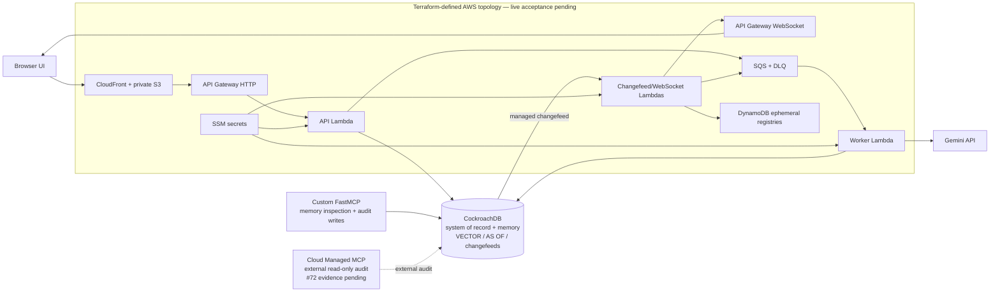

# Hindsight

An incident-response copilot with versioned, auditable memory.

Hindsight is an agentic application that treats AI memory the way SREs treat production systems: as infrastructure that should be auditable, transactional, observable, and recoverable. Its governed paths store versioned memories with provenance, record the reads behind governed decisions, and execute corrections without deleting history.

The CockroachDB schema combines episodic memory, semantic memory, and incident system-of-record data. Terraform defines an AWS deployment topology, but hosted behavior is accepted only after a successful exact-SHA workflow run.

This project is under active development for the CockroachDB and AWS "Build with Agentic Memory" hackathon. The roadmap, design decisions, and open questions live in this repository's Issues and Milestones rather than in documents in the codebase — start with the pinned issue titled "North Star" for the full picture.

## Evidence status

This README describes repository behavior covered by tests and a Terraform-defined deployment topology. Hosted behavior and URLs are claimed only when linked to a successful exact-SHA live-acceptance run. Hosted acceptance for the current revision is pending in [#65](https://github.com/OCHOLA-EDDYPHIL/hindsight/issues/65). Deterministic demos validate wiring and state transitions, not performance.

## Architecture



## Submission technology map

| Item | Role in Hindsight | Evidence status |
| --- | --- | --- |
| CockroachDB Vector Search | `VECTOR(1024)` storage, vector indexes, and distance-ranked semantic retrieval | Intended qualifying CockroachDB tool 1; implementation is DB-tested, current hosted acceptance pending #65 |
| CockroachDB Cloud Managed MCP | Planned official read-only, development-side inspection of identifiers from a future accepted hosted run | Organizer FAQ confirms this usage is eligible; Hindsight-specific transcript pending #72 |
| CockroachDB changefeeds | Authenticated webhook delivery and WebSocket fanout | Supporting database feature; exact-main hosted evidence pending #65 |
| `AS OF SYSTEM TIME` | Historical belief-state inspection within the retained MVCC window | Supporting database feature covered by DB-backed tests |
| Custom FastMCP server | Project-local domain inspector that also writes audit/read-provenance rows | Non-qualifying; distinct from CockroachDB Cloud Managed MCP |
| AWS Lambda | API, worker, changefeed, and WebSocket compute in the Terraform topology | Intended qualifying AWS service; exact-main deployment evidence pending #65 |

The organizer-linked [build-session FAQ](https://devpost.notion.site/CockroachDB-AWS-Hackathon-Build-Session-FAQ-399bf3c6a91d808ba1bbf1e0de57d9d9) says development-only, read-only Managed MCP usage is acceptable. Hindsight still requires a sanitized transcript tied to an accepted hosted run before presenting its specific audit workflow as complete.

## Clean-machine local setup

Prerequisites:

- Git;
- GNU Make and curl;
- Python 3.12;
- [uv](https://docs.astral.sh/uv/);
- Docker with the Compose plugin;
- Node.js and Terraform only for the full contributor checks below.

Clone an exact revision and install the locked Python environment. Until #74 makes the repository public, the clone requires GitHub authentication with repository access.

```bash
REVISION=PASTE_EXACT_SHA_HERE
git clone https://github.com/OCHOLA-EDDYPHIL/hindsight.git
cd hindsight
git checkout "$REVISION"
uv sync --frozen
```

Start local CockroachDB, enable the rangefeed/vector settings, and apply every migration:

```bash
make dev-up
make migrate-local
```

Run the same application checks with explicit no-network model fixtures:

```bash
export DATABASE_URL=postgresql://root@localhost:26257/hindsight?sslmode=disable
export LOCAL_DATABASE_URL="$DATABASE_URL"
export LLM_PROVIDER=deterministic
export EMBEDDING_PROVIDER=deterministic
export HINDSIGHT_DATABASE_URL_PARAM=
export HINDSIGHT_GEMINI_API_KEY_PARAM=
export HINDSIGHT_GEMINI_API_KEYS_PARAM=

uv run ruff check .
uv run pytest -q
uv run python scripts/run_learning_benchmark.py ci-smoke
node --input-type=module --check < src/hindsight/web/app.js
```

Start the local product API with an inline worker:

```bash
HINDSIGHT_FUNCTION_AUTH_TOKEN=local-demo \
LLM_PROVIDER=deterministic \
EMBEDDING_PROVIDER=deterministic \
make product-api-local
```

In another terminal, verify the DB-backed readiness route and then open the UI:

```bash
curl --fail --silent --show-error http://127.0.0.1:8766/v1/health/ready
```

Open `http://127.0.0.1:8766`. Teardown is `make dev-down`. `.env.example` documents optional local and deployment settings; never commit `.env` or copy hosted credentials into GitHub or Terraform state.

The full contributor gate additionally runs:

```bash
terraform fmt -check -recursive infra/terraform
terraform -chdir=infra/terraform/bootstrap init -backend=false -input=false
terraform -chdir=infra/terraform/bootstrap validate
terraform -chdir=infra/terraform/bootstrap test
terraform -chdir=infra/terraform/app init -backend=false -input=false
terraform -chdir=infra/terraform/app validate
terraform -chdir=infra/terraform/app test
```

CI is the current clean-runner evidence for that gate; the independent clean-machine rehearsal required by #73 remains pending.

## MCP memory inspection

Hindsight exposes a custom FastMCP server for domain-memory inspection. Its domain tools do not mutate memories, but the server writes audit and read-provenance rows. It is not CockroachDB Cloud Managed MCP:

```bash
uv run python scripts/run_mcp_server.py
```

The server uses `DATABASE_URL` for CockroachDB and exposes five tools:

- `current_beliefs`: current semantic memories by namespace, or episodic memories by episode id.
- `beliefs_as_of`: semantic belief state visible at an ISO-8601 timestamp.
- `provenance_chain`: a memory row, its origin/invalidation provenance, and decisions that read it.
- `decision_trace`: a governed decision and the row, provenance, and status context for its ordered memory reads.
- `mcp_audit_log`: recent MCP audit events.

Each inspection tool records an `mcp_audit_events` row with the tool name, actor, purpose, arguments, result count, and timestamp. Memory-row inspection also records `memory_reads` rows so MCP reads appear in the same provenance trail as agent reads.

## Telemetry ingestion demo

Hindsight includes a deterministic mechanism demo that turns an induced checkout failure into incident context:

```bash
uv run python scripts/run_telemetry_demo.py
```

The demo service emits Prometheus-style checkout metrics and structured JSON log events. Its retry-fanout failure produces a webhook-equivalent telemetry signal, opens an `incidents` row, writes an `incident_events` telemetry alert, stores the metric/log excerpt as semantic memory with `telemetry.ingest` provenance, and then runs the incident agent against that namespace.

## Poison and rewind demo

The signature memory mechanism demo uses a deterministic reasoning fixture and is scriptable:

```bash
uv run python scripts/run_poison_rewind_demo.py all
```

The sequence seeds a known-good payment-latency memory, runs the agent cleanly, inserts a plausible poisoned memory with provenance, shows the agent make the wrong recommendation, traces the bad decision back to the memory it recalled, rewinds the namespace in one audited transaction, and reruns the agent to produce the corrected recommendation.

For rehearsals, the same script exposes smaller steps:

```bash
uv run python scripts/run_poison_rewind_demo.py poison --namespace demo:payments
uv run python scripts/run_poison_rewind_demo.py run --namespace demo:payments --label poisoned
uv run python scripts/run_poison_rewind_demo.py diagnose --decision-id agent:demo:payments:poisoned:plan
```

## Cross-episode mechanism demo

The repeat-incident demo illustrates the mechanism: a resolved episode produces an evidence-cited procedural lesson, and a later incident retrieves that lesson. It is intentionally not a benchmark and reports no improvement metric:

```bash
make cross-episode-demo-local
```

To inspect the same fixed namespace in the dashboard, start this command first:

```bash
uv run python scripts/run_memory_dashboard.py \
  --db-url "$DATABASE_URL" \
  --namespace demo:cross-episode
```

Then run the mechanism demo in another terminal without generating a random session namespace:

```bash
uv run python scripts/run_cross_episode_demo.py \
  --db-url "$DATABASE_URL" \
  --namespace demo:cross-episode \
  --keep-existing
```

The output includes the typed lesson, its citations and lineage, and the lesson recalled by episode two. Performance claims belong to the separate three-arm benchmark: no lesson, a project-curated reference lesson derived from the external simulator specification, and a normally consolidated lesson. The frozen corpus balances six independent failure mechanisms—retry amplification, cache stampedes, connection leaks, hot partitions, poison messages, and lock contention—across pilot and confirmation splits. Source evidence lives outside the tested arm namespaces. Every arm receives identical background and hard lexical distractors, and the claim gate verifies that the model saw the same ordered non-target content in every arm; random memory IDs and mechanism labels are never shown to the model. Recurrence prompts deliberately share little vocabulary with their targets. A live study proceeds only when both reference and consolidated lessons rank first under a precommitted semantic-profile distance cutoff.

Live benchmark commands require explicit reasoning and semantic-embedding providers. For Gemini, keep the API key in the local environment or `.env`, select both providers explicitly, and choose the cosine-distance cutoff on a separate calibration corpus before looking at pilot or confirmation outcomes. Profile activation, the pilot manifest, and the durable preregistration must all contain that same cutoff:

```bash
export LLM_PROVIDER=gemini
export EMBEDDING_PROVIDER=gemini
export GEMINI_MODEL=gemini-2.5-flash
export GEMINI_EMBEDDING_MODEL=gemini-embedding-2
export BENCHMARK_MAX_DISTANCE=PASTE_PRECOMMITTED_COSINE_DISTANCE_HERE
export HINDSIGHT_BENCHMARK_CODE_SHA="$(git rev-parse HEAD)"

uv run python scripts/reembed_memories.py --max-distance "$BENCHMARK_MAX_DISTANCE"
uv run python scripts/run_learning_benchmark.py pilot \
  --max-distance "$BENCHMARK_MAX_DISTANCE"
export PILOT_EXPERIMENT_ID=PASTE_PILOT_EXPERIMENT_ID_HERE
uv run python scripts/run_learning_benchmark.py preregister \
  --pilot-experiment-id "$PILOT_EXPERIMENT_ID"
uv run python scripts/run_learning_benchmark.py confirmation \
  --pilot-experiment-id "$PILOT_EXPERIMENT_ID"
```

`preregister` derives the minimum independent sample from the completed pilot, then commits all twelve pilot-frozen held-out variants rather than outcome-selecting a subset. Two repetitions are aggregated within each incident variant, and same-mechanism variants are then aggregated before inference. Efficacy and reference noninferiority use one-sided exact sign-flip tests over mechanism-level action differences with Bonferroni control, plus an observed one-action minimum-effect gate; the pilot power calculation is explicitly a nominal normal approximation. Six mechanisms support pilot standard deviations up to about 0.755 actions at the frozen alpha, power, and effect target. If either endpoint requires more than six mechanisms, confirmation is not created and the study authorizes no claim; the corpus must be versioned and expanded without retuning against held-out outcomes. The study contract pins the code commit, corpus, providers, active embedding profile, cutoff, simulator, and endpoints, and permits only one outcome-bearing pilot and confirmation for that identity. `confirmation` loads that durable contract and cannot regenerate it. `ci-smoke` uses deterministic fixtures, skips live semantic rank checks, and is never eligible for performance claims.

The owner-authorized `live acceptance` workflow is configured to run Gemini provider, migration, hosted deployment, benchmark, and Firefox checks on GitHub-hosted runners. It assumes the demo role through OIDC and reads the encrypted database and Gemini pool from SSM; local `.env` credentials are not copied into GitHub. Gemini semantic validation is mandatory, and only a successful exact-SHA run is hosted evidence.

## Live memory dashboard

The demo dashboard shows semantic memories and rewind operations for one namespace as they change:

```bash
make dev-up
make migrate-local
make memory-dashboard-local
```

Open the printed local URL, then run the poison/rewind sequence against the same local database and namespace:

```bash
make poison-rewind-demo-local
```

The page receives memory and rewind events through a CockroachDB changefeed-backed Server-Sent Events stream. Invalidated memories remain visible with strikethrough styling, and the timeline scrubber can replay belief state at earlier timestamps.

Set `HINDSIGHT_DASHBOARD_AUTH_TOKEN` or pass `--auth-token` to require dashboard authentication. Visit the dashboard once with `?token=<token>` to set the browser cookie; scripted checks can use `Authorization: Bearer <token>`.

For final demo checks against CockroachDB Cloud, point `DATABASE_URL` or `--db-url` at the Cloud cluster explicitly. Local CockroachDB is the default rehearsal target.

## Incident cockpit and product API

The enhanced dashboard adds the incident workflow around the live memory view: agent run phases, plans and approvals, exact decision-to-memory influence, provenance details, and a guarded rewind preview. Read-only inspection stays public; model calls and memory mutations require the shared operator token.

Run the complete local product surface with an inline background worker:

```bash
make dev-up
make migrate-local
HINDSIGHT_FUNCTION_AUTH_TOKEN=local-demo LLM_PROVIDER=deterministic make product-api-local
```

Open `http://127.0.0.1:8766`. In the Terraform-defined hosted topology, SQS replaces the inline worker while CockroachDB remains the intended durable source of run state and ordered phase events; exact-main hosted acceptance is pending #65.

The versioned API and interactive OpenAPI document are available under `/v1` and `/v1/docs`. Its primary resources are:

- incidents and asynchronous agent runs;
- approval/resume of interrupted runs;
- current or historical belief state;
- memory provenance and decision influence;
- immutable correction previews and asynchronous rewind, retraction, supersession, and review operations;
- operator-only signature-demo controls.

Run creation and governed memory mutations accept an `Idempotency-Key` header and return `202 Accepted`. Mutation workers verify namespace revisions, lineage closure, preview expiry, and embedding generation before committing any effect.

The hosted configuration routes CockroachDB incident, governed-memory, operation, and agent-run changes to an authenticated webhook. It is designed to queue consolidation only for real transitions to `resolved` and fan versioned events through API Gateway WebSockets. DynamoDB is configured for expiring connection subscriptions, while CockroachDB remains the intended durable store. This path is not hosted evidence until #65 passes.

Deployment automation manages the changefeed lifecycle separately from schema migrations:

```bash
make changefeed-apply
make changefeed-status
make changefeed-pause
```

`changefeed-apply` is idempotent for the same endpoint and token. Teardown pauses the feed before removing the AWS webhook so CockroachDB does not retry a dead sink.

## Retrieval and embedding profiles

The hosted configuration selects strict semantic vector search by default. In DB-backed tests, a miss stays empty; keyword fallback occurs only when a run explicitly selects the degraded `semantic_then_keyword` policy, and retrieval attempts record their ordered hits, decision, and profile. The deterministic hashing provider is a lexical-hash test fixture—not a semantic encoder—and hosted activation is configured to reject it.

The submission configuration selects an SSM-backed Gemini key pool for reasoning and 1,024-dimensional `gemini-embedding-2` vectors. Local runs can set `GEMINI_API_KEY` plus numbered keys such as `GEMINI_API_KEY_1`. Hosted behavior remains evidence-pending until an exact-SHA live-acceptance run succeeds.

Bedrock adapters remain in the provider abstraction for explicit development work, but they are quota-deferred, unhosted, not selected or accepted for the deployed submission, excluded from live acceptance, and not part of this submission. Removal of legacy production variables and IAM is tracked in #67.

Embedding spaces are content-addressed profiles. The governed rotation path builds vectors side-by-side and checks coverage before activation. #60 tracks the remaining active-profile write coverage and recall-transparency work, so no stronger hosted consistency claim is made yet:

```bash
uv run python scripts/reembed_memories.py
```

## AWS deployment lifecycle

Terraform declares the ephemeral AWS application: private S3 UI hosting through CloudFront, API Gateway HTTP and WebSocket APIs, split Lambda artifacts, SQS with a dead-letter queue, expiring WebSocket and Gemini-cooldown registries, IAM, logs, throttles, alarms, and the DNS-only Cloudflare alias. CockroachDB Cloud, SecureString values, ACM validation, deployment IAM, and Terraform bootstrap state are intentionally external to routine teardown.

Bootstrap the deployment role and custom-domain certificate once from `infra/terraform/bootstrap`, reusing an existing state bucket and GitHub OIDC provider. The `deploy demo` workflow can then produce a plan or apply it through the `demo` environment. Apply is configured to check SSM, ACM, Cloudflare, and CockroachDB before creating resources. The `destroy demo` workflow requires the exact `destroy-demo` confirmation, pauses CockroachDB delivery first, and targets only the application stack.

Required GitHub repository variables are `AWS_DEPLOY_ROLE_ARN`, `TF_STATE_BUCKET`, `HINDSIGHT_ACM_CERTIFICATE_ARN`, `HINDSIGHT_DOMAIN_NAME`, and `CLOUDFLARE_ZONE_ID`, plus optional region and SSM parameter-name overrides. `CLOUDFLARE_API_TOKEN` is a zone-scoped `demo` environment secret. The workflows authenticate to AWS through GitHub OIDC and do not reference long-lived AWS access keys.

## OpenTelemetry memory traces

The memory layer emits safe OpenTelemetry spans for reads, writes, invalidations, rewinds, and agent recall/reasoning/reflection boundaries. Spans include namespaces, memory IDs, counts, decision IDs, and writer names, but do not record raw memory content, prompts, recall queries, DB URLs, secrets, or operator-entered reasons.

Run a local Jaeger collector and a traced demo:

```bash
make dev-up
make migrate-local
make otel-up
make poison-rewind-trace-local
```

Open Jaeger at `http://localhost:16686` and search for the `hindsight-demo` service. The expected poison/rewind sequence is clean recall, poison write, poisoned recall, rewind invalidation, and corrected recall. The expected cross-episode sequence includes the consolidation write and episode-two lesson recall; the independent clean-machine trace rehearsal remains pending #73:

```bash
make cross-episode-trace-local
```

## License

Apache License 2.0. See [LICENSE](LICENSE).
