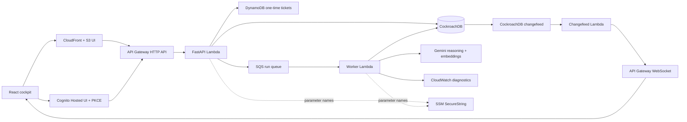
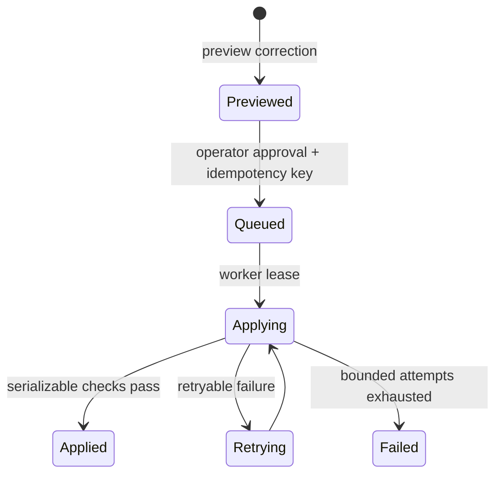

# Architecture

Hindsight separates durable product truth from model inference and delivery infrastructure. CockroachDB records incidents, runs, memory versions, decisions, reviews, operations, and dispatch state. AWS executes queued work and projects notifications, but it does not replace the database system of record.

## Decision and memory path

Semantic beliefs have stable identities and immutable versions. Embeddings are stored in tenant-leading CockroachDB vector indexes. Positive-guidance recall filters by tenant, namespace, bi-temporal validity, trust state, prompt-safety state, governance metadata, and the database-active embedding profile before ranking. Each governed decision records typed reads, quoted influence, lineage, provider and model metadata, the embedding profile, and the selection fingerprint.

Gemini reasoning uses a schema derived from the active safety context. Before producing a terminal recommendation, the model may select only a server-allow-listed CloudWatch diagnostic. The tool makes read-only calls within server-owned account, region, metric, dimension, statistic, period, and time-window bounds. Durable call budgets, attempt leases, and checkpoints bound the agent loop.

The model records recommendations; it does not execute the recommended infrastructure action. A model-selected governed-memory remediation is also only a proposal. Its selected memory, verbatim quote, current observations, preview effects, and fingerprints are shown to an authenticated operator. Approval must bind that exact proposal before the normal memory-operation worker can apply it.

## Generated memory admission

Resolving an incident can produce an evidence-linked procedural lesson candidate. The consolidation worker stores the structured lesson, source-evidence manifest, candidate and evidence fingerprints, and generation and semantic-validation receipts. The memory version is written as `review_required` with `audit_only` usage and is excluded from positive-guidance retrieval.

Protected operator APIs list and inspect pending, approved, and rejected candidates. A review preview binds the authenticated actor, action, reason, candidate ID, candidate memory ID, candidate fingerprint, and evidence fingerprint. Approval is fail-closed unless validation passed and every source memory or resolution event still matches its manifest. Execution closes the candidate and creates an active, positive-guidance successor with the same belief identity and explicit candidate and operation provenance. Rejection creates no successor and leaves the candidate audit-visible but retrieval-ineligible. Both outcomes are terminal review history.

See [ADR 0002](adr/0002-generated-machine-memory-admission.md).

## Historical inspection and product rewind

Historical cockpit snapshots use CockroachDB `AS OF SYSTEM TIME` in a separate read transaction. They reconstruct persisted memory and operation rows at the requested cutoff and do not change current state, enqueue work, or rerun a recommendation.

A product rewind is a governed mutation. An authenticated operator approves an immutable preview; the queued worker rechecks the preview, namespace revisions, lineage, evidence, and current state in a serializable transaction. It closes current versions outside the approved target logical state and creates new rewind-reassertion versions where a historical belief must become current again. It does not restore the database, edit historical rows, roll back run events, or execute an infrastructure recommendation.

## Controlled recommendation evidence

The controlled payments comparison uses a canonical envelope around each recorded recommendation. The envelope binds scenario and run identity, invariant incident and tool inputs, ordered observations, model-request configuration, prompt-template and rendered-prompt digests, embedding and retrieval configuration, action catalog, ordered memory versions, the declared correction, and the structured decision output.

The public projection rebuilds that envelope after redacting tenant, namespace, incident text, memory content, prompt text, provenance text, and private identifiers. Hindsight reports separate proof states for the memory correction, structured action delta, and controlled-pair eligibility. Missing or inconsistent material produces `unavailable` or `not_proven`; repeatability and service recovery remain `unavailable` because the product does not measure them in this comparison.

The downloadable JSON uses the same redacted proof summary and before/after envelopes. Its canonical SHA-256 digest is published in the scenario receipt and response header. The browser computes the digest of the downloaded bytes and refuses the download if those bindings differ. The digest detects mismatched content; it is not a digital signature and does not broaden the recommendation-only claim.

See [ADR 0003](adr/0003-controlled-causal-evidence.md).

## Durable dispatch and terminal delivery

An incident run and its first dispatch command commit together. A dispatcher leases pending outbox rows and sends tenant-bearing, sequence-bearing commands to SQS. Worker attempts have ownership tokens, leases, monotonic command sequence, and transactional acknowledgement with run effects. Scheduled dispatch recovers unsent commands and expired active attempts; scheduled reaping handles expired memory operations.

Delivery is at least once. Tenant-scoped idempotency keys, canonical request fingerprints, durable dispatch identity, attempt fencing, and database transactions prevent duplicate or stale workers from committing the same logical effect.

Deterministic terminal messages are recorded in a strict DynamoDB quarantine ledger instead of being retried indefinitely. The ledger retains allow-listed identity fields and digests, not the raw SQS body. Only a terminally exhausted run is eligible for the owner-gated redrive path, which creates one idempotent fresh run from the persisted incident, namespace, input, service, and retrieval policy. It does not resume or rewrite the failed run. The raw fallback DLQ has no worker consumer.

## Memory correction lifecycle

Corrections proceed as previewed, fingerprinted operations:

Retraction closes confirmed causal descendants. Evolution-style supersession preserves descendants but removes affected beliefs from trusted recall until review. Historical rows are never edited in place. Namespace revision, lineage closure, preview expiry, authorization, selected evidence, and embedding generation are rechecked in the applying transaction.

Embeddings are rebuildable indexes. A content-addressed profile is built alongside the active profile and becomes active only after current-memory coverage is complete. Durable belief and provenance records remain authoritative.

## Tenant, identity, and realtime boundaries

Tenant identity is server-owned. Public `/v1` reads bind the fixed public tenant. Protected `/v2` requests use API Gateway-verified Cognito claims, an opaque database principal mapping, and the intersection of token and mapped roles. Queue commands carry the server-selected tenant. Tenant-leading keys, relationships, row-level policies, and lifecycle guards preserve the boundary in CockroachDB.

The HTTP API issues 60-second, single-use realtime tickets. DynamoDB stores only ticket digests and bound claims; WebSocket connect atomically consumes one ticket. Connection, subscription, and delivery-idempotency records are expiring projections. CockroachDB outbox events feed the changefeed relay, and reconnecting clients reload authoritative HTTP state rather than treating socket history as durable truth.

## Tenant retirement

The lifecycle implementation archives a tenant, exports a canonical snapshot and manifest to versioned S3 objects, verifies content and schema fingerprints, requires explicit matching confirmation, fences product and realtime access, purges cataloged tenant data, and retains an identity tombstone. Server-owned public, acceptance, and learning tenants cannot enter that purge path.

This is a privileged, destructive operating path. Each deployment must establish suitable retention, permissions, export verification, backup, and recovery policy before enabling it for a tenant.

## Infrastructure and audit ownership

Terraform separates bootstrap, application, lifecycle, and edge concerns. The application state owns packaged Lambdas, queues, DynamoDB tables, API Gateways, the UI bucket and CloudFront distribution, logs, alarms, Cognito resources, and optional DNS attachment. CockroachDB Cloud, secret values, prerequisite account resources, and lifecycle exports remain external or separately managed.

The repository's infrastructure auditor is an application-owned SQL path: it authenticates a pinned CockroachDB guidance source, executes a fixed read-only catalog, checks tenant-bound persisted provenance, and separately probes that a restricted auditor role cannot mutate or grant.

CockroachDB Managed MCP is a separate development inspection surface for schema shape and selected persisted identities. It is not used by the application runtime or the repository auditor. An MCP inspection does not prove deployed SQL privileges, vector-index query plans or capacity, or parity with a database after the inspection was taken.
