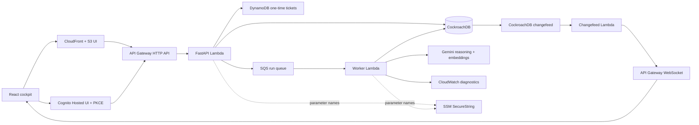
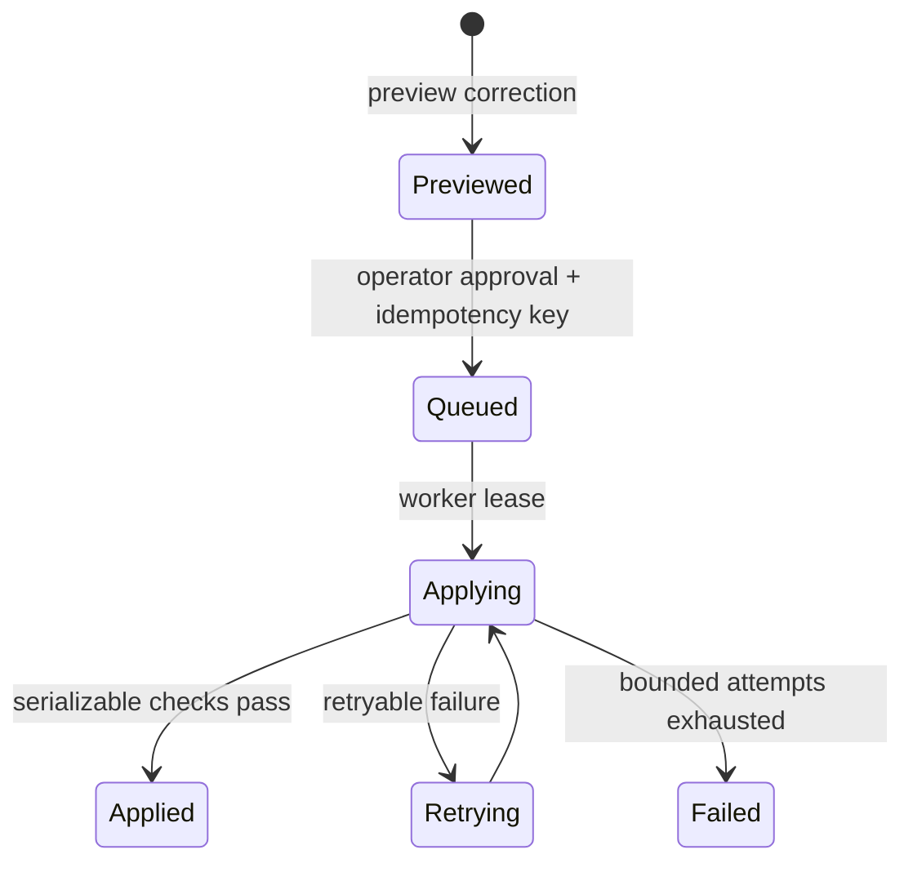

# Architecture

Hindsight separates durable product truth from bounded model and delivery infrastructure. CockroachDB records memory, decisions, approvals, operations, and dispatch state. AWS executes and projects work but does not replace the database system of record.

## Decision and memory path

Semantic beliefs have stable identities and immutable versions. Gemini embeddings are stored in tenant-leading CockroachDB vector indexes. Recall filters by tenant, namespace, validity, trust, and active embedding profile before ranking. Each run records typed reads, quoted influence, lineage, provider/model metadata, the embedding profile, and the selection fingerprint used by the decision.

Gemini reasoning uses a schema derived from the active safety context. Before a terminal decision, the model may select only a server-allow-listed CloudWatch diagnostic. The tool can make at most three read-only calls within a 15-minute window. A current observation then permits a schema-constrained recommendation or an allow-listed governed-memory remediation. Model work happens outside mutation transactions; durable call budgets, leases, and checkpoints prevent an unconstrained loop.

A governed remediation is not executed directly by the model. The selected memory and verbatim quote, current observations, preview effects, and fingerprints are shown to an authenticated operator. Approval binds that exact proposal, and execution proceeds through the normal durable operation path.

## Durable dispatch and recovery

An incident run and its first dispatch command commit together. A dispatcher leases pending outbox rows and sends tenant-bearing, sequence-bearing commands to SQS. Worker attempts have ownership tokens, leases, monotonic sequence, and transactional acknowledgement with run effects. Scheduled dispatch recovers unsent or expired-active commands; scheduled reaping recovers expired correction operations. Partial batch failures return to SQS, and bounded receive exhaustion moves a message to the DLQ.

Delivery is at least once. Tenant-scoped idempotency keys, canonical request fingerprints, durable dispatch identity, attempt fencing, and database transactions protect committed effects from duplicate or stale execution.

## Memory correction lifecycle

Corrections proceed as previewed, fingerprinted operations:

A rewind closes versions outside the selected logical state and creates audited reassertion versions where needed. Retraction closes confirmed causal descendants. Evolution-style supersession preserves descendants but removes affected beliefs from trusted recall until review. Historical rows are never edited in place. Namespace revision, lineage closure, preview expiry, authorization, selected evidence, and embedding generation are rechecked in the applying transaction.

Embeddings are rebuildable indexes. A content-addressed profile is built alongside the active profile and becomes active only after current-memory coverage is complete. Durable belief and provenance records remain authoritative.

## Tenant, identity, and realtime boundaries

Tenant identity is server-owned. Public `/v1` reads bind the fixed public-demo tenant. Protected `/v2` requests use API Gateway-verified Cognito claims, an opaque database principal mapping, and the intersection of token and mapped roles. Queue commands carry the server-selected tenant. Tenant-leading keys, relationships, row-level policies, and lifecycle guards preserve the boundary in CockroachDB.

The HTTP API issues 60-second, single-use realtime tickets. DynamoDB stores only ticket digests and bound claims; WebSocket connect atomically consumes one ticket. Connection, subscription, and delivery-idempotency records are expiring projections. CockroachDB outbox events feed the changefeed relay, and reconnecting clients reload authoritative HTTP state rather than trusting socket history.

## Tenant retirement

The lifecycle implementation archives a tenant, exports a canonical snapshot and manifest to versioned S3 objects, verifies content and schema fingerprints, requires explicit matching confirmation, fences product and realtime access, purges cataloged tenant data, and retains an identity tombstone. Server-owned public, acceptance, and learning tenants cannot enter that purge path.

This is a privileged, destructive operating path. Its code and local fixtures do not substitute for a completed hosted recovery rehearsal; operators must validate retention, permissions, export verification, and recovery policy in their own environment before use.

## Infrastructure and audit ownership

Terraform separates bootstrap, application, lifecycle, and edge concerns. The application state owns packaged Lambdas, queues, DynamoDB tables, API Gateways, the UI bucket and CloudFront distribution, logs, alarms, Cognito resources, and optional DNS attachment. CockroachDB Cloud, secret values, prerequisite account resources, and lifecycle exports remain external or separately managed.

The official CockroachDB Cloud Managed MCP Server is an independent read-only audit surface for persisted database identities. It is not the application's runtime database connection and does not participate in decisions or mutations.
