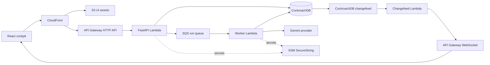
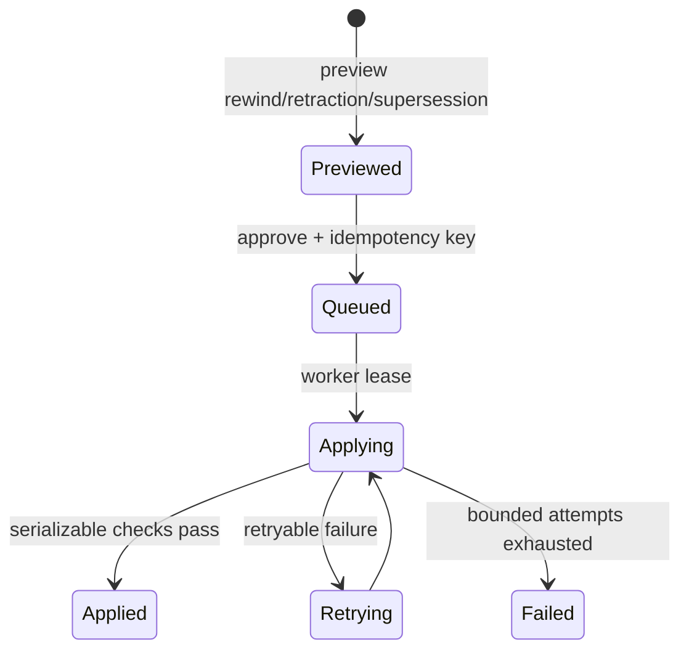

# Architecture

Hindsight separates durable product state from bounded delivery infrastructure. CockroachDB is the system of record; AWS services execute and deliver work but do not replace database truth.

## Durable state and execution

An incident run and its initial dispatch command are committed together. A dispatcher leases pending outbox rows and sends tenant-bearing commands to SQS. Worker attempts use ownership fences and leases; partial batch failures are returned to SQS, retry exhaustion moves messages to a DLQ, and scheduled recovery processes expired work. Queue delivery is therefore at least once, while database idempotency and attempt fencing protect durable state from duplicate or stale execution.

The demo deployment bounds API and worker timeouts, reserved concurrency, queue visibility, receive counts, and batch sizes in Terraform. Those are safety and cost controls, not throughput guarantees.

## Memory and correction lifecycle

Semantic beliefs have stable identities and immutable versions. Decisions record typed reads, causal lineage, provider/model metadata, and retrieval behavior. Corrections proceed as previewed, fingerprinted operations:

A rewind closes versions outside the selected logical state and creates audited reassertion versions where needed. It never edits historical rows in place. Retraction follows confirmed causal edges; evolution-style supersession preserves descendants but removes affected beliefs from trusted retrieval until review. Namespace revision, lineage closure, preview expiry, authorization, and embedding generation are rechecked in the applying transaction.

Embeddings are rebuildable indexes. A content-addressed embedding profile is built alongside the active profile and becomes active only after current-memory coverage is complete. The durable belief and provenance records remain authoritative.

## Tenant and realtime boundaries

Tenant identity is bound by the server, not accepted from public request parameters. Public `/v1` routes use one fixed demo tenant. Protected `/v2` routes bind a separate server-owned tenant after bearer authentication. Trusted queue messages carry a validated tenant ID, and database tables, keys, relationships, and row-level policies preserve that boundary.

CockroachDB outbox events feed the realtime relay. Short-lived signed tickets bind WebSocket connections to the server-selected tenant; DynamoDB stores expiring connection, subscription, and delivery-idempotency records. Realtime delivery is a projection of durable database state, so clients recover by reading the API rather than treating a socket event as authoritative.

## Infrastructure ownership

Terraform is split into bootstrap, application, and edge concerns. The application stack owns the demo application resources in its state: packaged Lambdas, queues, DynamoDB tables, API Gateways, UI bucket and CloudFront distribution, logs, alarms, and optional DNS attachment. CockroachDB Cloud, secret values, and prerequisite account/bootstrap resources remain external. Migrations and changefeed configuration are ordered deployment operations, not Terraform-owned database objects.
